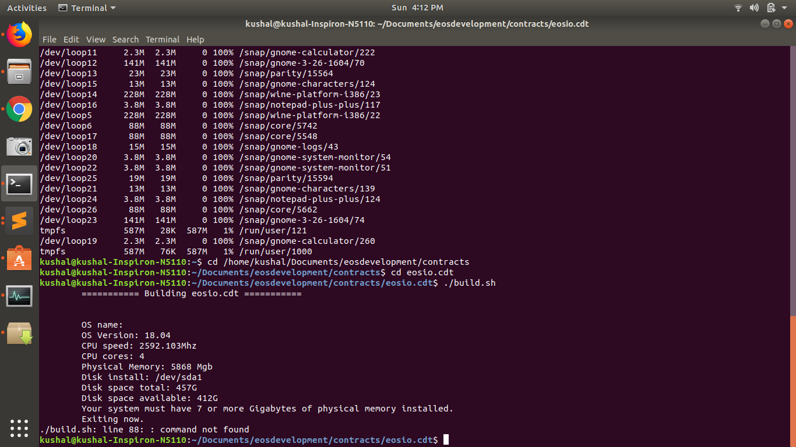

# EOS.IO 
[https://github.com/EOSIO/Documentation/blob/master/TechnicalWhitePaper.md ]

> The EOS.IO software introduces a new blockchain architecture designed to enable vertical and horizontal scaling of decentralized applications.

> The software provides accounts, authentication, databases, asynchronous communication, and the scheduling of applications across many of CPU cores or clusters. The resulting technology is a blockchain architecture that may ultimately scale to millions of transactions per second, eliminates user fees, and allows for quick and easy deployment and maintenance of decentralized applications, in the context of a governed blockchain.

### Requirements for Blockchain Applications
1. Support Millions of Users
2. Free Usage
3. Easy Upgrades and Bug Recovery
4. Low Latency
5. Sequential Performance
6. Parallel Performance


### Identify a suitable use case in a domain of your choice that must be solved with Blockchain or having Blockchain technology adds value to this usecase.

- **Use Case:** My Pubic Lost Identity **[#MyLostIdentity]**

- **Description:**  

> Have you given a thought over these???

1. At how many places you have distributed your Identity proofs.
2. Why you receives 100's of spam calls in a month. Sometimes from creditcard companies, sometimes from telecom companies, etc.
3. You regularly receives the spams.
4. You don't want to share your complete profile details with anyone, but still wants to be verified as a Authentic person.
5. If your important documents got stoken.

### Define a problem statement for which you intend to write a smart contract. 

- If the things mentioned above worries you then you are at correct place.
- Our project **[#MyLostIdentity]** helps to solve these problems.
- Our project Highlights:
    1. We will be building a Decentralised Application. The mainpurpose of our project is to map all the IDs of an User with the UniqueID that can be share.
    2. This UniqueID will be protected by multi step authentication.
    3. The user can use this UniqueID anywhere like buying Insurance, applying for any Exams or buying a property.

> **QUESTION: But what will happen to my personalIDs that are already shared?**
> **SOLUTIONS:** We will join with third parties and will ask them to join our decentralized solution, that is not governed by anyone. So we will match the user UniqueID with the third party DB Ids and will ask them to delete their DB. and since Blockchain cannot be dropped, the data is safe.


> **QUESTION: How our solution will help?**
> **SOLUTIONS:** This will be a win-win situation for both User and third parties. Third parties don't have to maintain a seperate DB and resources to manage the User Identity. 
> It will be secure for user to get identified by multiple parties without a delay.

> **QUESTION: But why EOS and not anyother Blockchain**
> **SOLUTIONS:** EOS provides scalability and there is no fess invovled for the Transactions


### Install and write a smart contract using EOSIO and its C++ API

- Tried EOS first time over the weekend. 
- Done the Setup of EOSIO, but since EOS.DT requires more then 7GB to develop. I got stuck.

- New to this Blockchain but have experience of devloping DAPPS using Ethereum.
- Went through the working application. Tried some basic work flows.


### HOW EOS Works

- Smart contract compiles to ABI or WASM when compiled using eosiocpp
```
eosiocpp -o destination.wasm source.cpp (here, -o generates .wasm and .wast files)
eosiocpp -g destination.wasm source.cpp (here, -g generates .abi file)
```
- Both contracts and ABI can be uploaded to Blockchain via cleos set contract call.
```
cleos set contract account_name ../contract_dir -p account_name@active
```
- Smart contract interact with Multi Index table.
- It can interact with front end applications using frameworks like: React-redux
- Front end services calls the Smart contract using API Service.


